# Creando una Red Social

Bienvenida a tu primer proyecto del track de Frontend en Laboratoria.

En este proyecto construirás una red social, cuya temáticas dejaremos a tu elección.

# TripLife

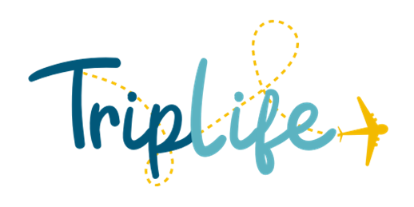

## Resumen del Proyecto

TripLife es una red social para viajeros creada para compartir y recordar tus historias, fotos y tips con otros viajeros que disfrutan vivir a través de los viajes.

## Objetivo de TripLife
* Comparte y recomienda nuevos lugares.
* Regístrate con facebook o google.
* Comparte el momento más significativo del lugar en el que estés.
* Elige quién puede ver lo que compartes.
* Conoce nuevos lugares a través de otros viajeros.
* Reacciona a los momentos que más te gusten de otros viajeros. 

## Sketch
Se generarón ideas en papel para entender al usuario, desde el registro de usuario, registro de proveedores y sobre todo que al usuario se le hiciera facil entender la app.

### Login Sketch
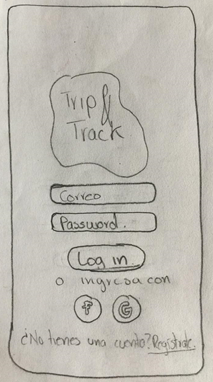

### Registro de Usuario Sketch
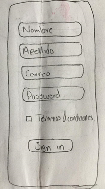

### Entorno de la app Sketch
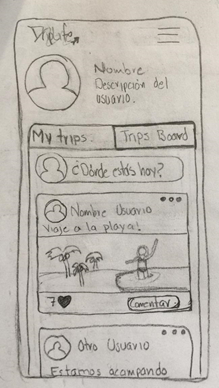

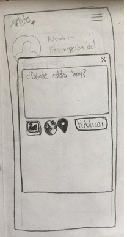

### App de desarrollo

Se trabajo con la parte de diseño desk y responsive. Utilizando los conocimientos de HTMLL5, CSS3, Vanilla JavaScript(ES6+), aprendiendo firebase para el entorno de datos en tiempo real, creando su estructura de datos
Trabajando con moduliración para llevar un entorno de SPA

##Desktop

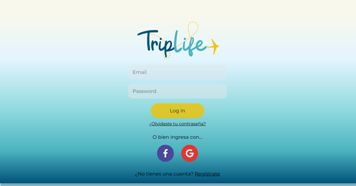

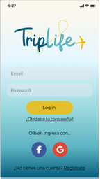

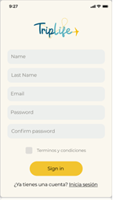

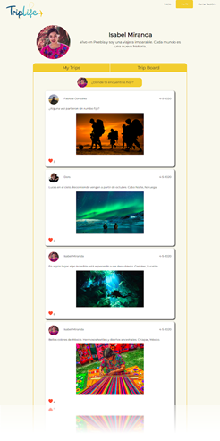

##Mobile

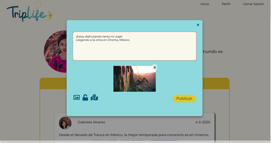

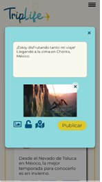

### Objetivos de aprendizajes pendientes

### HTML y CSS

* [x] [HTML semántico](https://developer.mozilla.org/en-US/docs/Glossary/Semantics#Semantics_in_HTML)
* [x] [CSS `flexbox`](https://css-tricks.com/snippets/css/a-guide-to-flexbox/)
* [ ] Construir tu aplicación respetando el diseño realizado (maquetación).

### DOM y Web APIs

* [x] [Manipulación dinámica del DOM](https://developer.mozilla.org/es/docs/Referencia_DOM_de_Gecko/Introducci%C3%B3n)
* [x] [History API](https://developer.mozilla.org/es/docs/DOM/Manipulando_el_historial_del_navegador)
* [ ] [`localStorage`]

### Javascript

* [x] [Uso de callbacks](https://developer.mozilla.org/es/docs/Glossary/Callback_function)
* [ ] [Consumo de Promesas](https://scotch.io/tutorials/javascript-promises-for-dummies#toc-consuming-promises)
* [x] Uso ES modules
([`import`](https://developer.mozilla.org/en-US/docs/Web/JavaScript/Reference/Statements/import)
| [`export`](https://developer.mozilla.org/en-US/docs/Web/JavaScript/Reference/Statements/export))

### Firebase

* [x] [Firestore](https://firebase.google.com/docs/firestore)
* [x] [Firebase Auth](https://firebase.google.com/docs/auth/web/start)
* [ ] [Firebase security rules](https://firebase.google.com/docs/rules)
* [ ] [Uso de onSnapshot](https://firebase.google.com/docs/firestore/query-data/listen)
| [onAuthStateChanged](https://firebase.google.com/docs/auth/web/start#set_an_authentication_state_observer_and_get_user_data)

### Testing

* [ ] [Testeo de tus funciones](https://jestjs.io/docs/es-ES/getting-started)
* [ ] [Testeo asíncrono](https://jestjs.io/docs/es-ES/asynchronous)
* [ ] [Mocking](https://jestjs.io/docs/es-ES/manual-mocks)

### Colaboración en Github

* [x] Branches
* [x] Pull Requests
* [ ] Tags

### Organización en Github

* [x] Projects
* [ ] Issues
* [ ] Labels
* [ ] Milestones

### Buenas prácticas de desarrollo

* [x] Modularización
* [x] Nomenclatura / Semántica
* [ ] Linting

***

## Recursos

### Mobile first

El concepto de [_mobile first_](https://www.mediaclick.es/blog/diseno-web-responsive-design-y-la-importancia-del-mobile-first/)
hace referencia a un proceso de diseño y desarrollo donde partimos de cómo se ve
y cómo funciona la aplicación en un dispositivo móvil primero, y más adelante se
ve como adaptar la aplicación a pantallas progresivamente grandes y
características específicas del entorno desktop. Esto es en contraposición al
modelo tradicional, donde primero se diseñaban los websites (o webapps) para
desktop y después se trataba de _arrugar_ el diseño para que entre en pantallas
más chicas. La clave acá es asegurarse de que desde el principio diseñan usando
la vista _responsive_ de las herramientas de desarrollador (developer tools) del
navegador. De esa forma, partimos de cómo se ve y comporta la aplicación en una
pantalla y entorno móvil.

### Múltiples vistas

En proyectos anteriores nuestras aplicaciones habían estado compuestas de una
sola _vista_ principal (una sóla _página_). En este proyecto se introduce la
necesidad de tener que dividir nuestra interfaz en varias _vistas_ o _páginas_
y ofrecer una manera de navegar entre ellas.

### Escritura de datos

En los proyectos anteriores hemos consumido (leído) datos, pero todavía no
habíamos escrito datos (salvar cambios, crear datos, borrar, ...). En este
proyecto tendrás que crear (salvar) nuevos datos, así como leer, actualizar y
modificar datos existentes. Estos datos se podrán guardar de forma remota
usando [Firestore](https://firebase.google.com/docs/firestore) o de forma
local utilizando`localStorage`.

### Autenticación y autorización

Hasta el momento, los proyectos han sido pensados como recursos públicos, donde todos
los usuarios compartían un mismo rol y la misma información.

En este proyecto tendrás que diferenciar la información a mostrar y modificar,
dependiendo de la identidad del usuario.
De la misma manera deberás crear reglar de autorización para el acceso a los
datos.

Para esto utilizaras respectivamente
[`Firebase authentication`](https://firebase.google.com/docs/auth/) y
[`Firestore security rules`](https://firebase.google.com/docs/firestore/security/get-started)

### CSS

En este proyecto queremos que ganes confianza y experiencia con CSS profesional,
por eso usarás [`flexbox`](https://css-tricks.com/snippets/css/a-guide-to-flexbox/)
para posicionar tus elementos.

Recuerda que no puedes usar frameworks CSS, sólo *vanilla css* o [*sass*](https://sass-lang.com/).

### Otras:

* [Pildora SPA](https://www.loom.com/share/fa63a8ad0e9a43428222c15b6f6613d3)
* [Repositorio de pildora de SPA](https://github.com/betsyvies/bootcamp-spa)
* [Pildora de mock Firebase](https://www.youtube.com/watch?v=06myVn41OTY&t=1s)
* [Repositorio de pildora de mock Firebase](https://github.com/Danielalab/2018-2-Testing)
* [Pildora MVC](https://github.com/merunga/todomvc-vanillajs)
* [Modulos: Export](https://developer.mozilla.org/es/docs/Web/JavaScript/Referencia/Sentencias/export)
* [Modulos: Import](https://developer.mozilla.org/es/docs/Web/JavaScript/Referencia/Sentencias/import)
* [Diseño web, responsive design y la importancia del mobile first - Media Click](https://www.mediaclick.es/blog/diseno-web-responsive-design-y-la-importancia-del-mobile-first/)
* [Mobile First: el enfoque actual del diseño web móvil - 1and1](https://www.1and1.es/digitalguide/paginas-web/diseno-web/mobile-first-la-nueva-tendencia-del-diseno-web/)
* [Mobile First - desarrolloweb.com](https://desarrolloweb.com/articulos/mobile-first-responsive.html)
* [Mobile First - ZURB](https://zurb.com/word/mobile-first)
* [Mobile First Is NOT Mobile Only - Nielsen Norman Group](https://www.nngroup.com/articles/mobile-first-not-mobile-only/)

***
